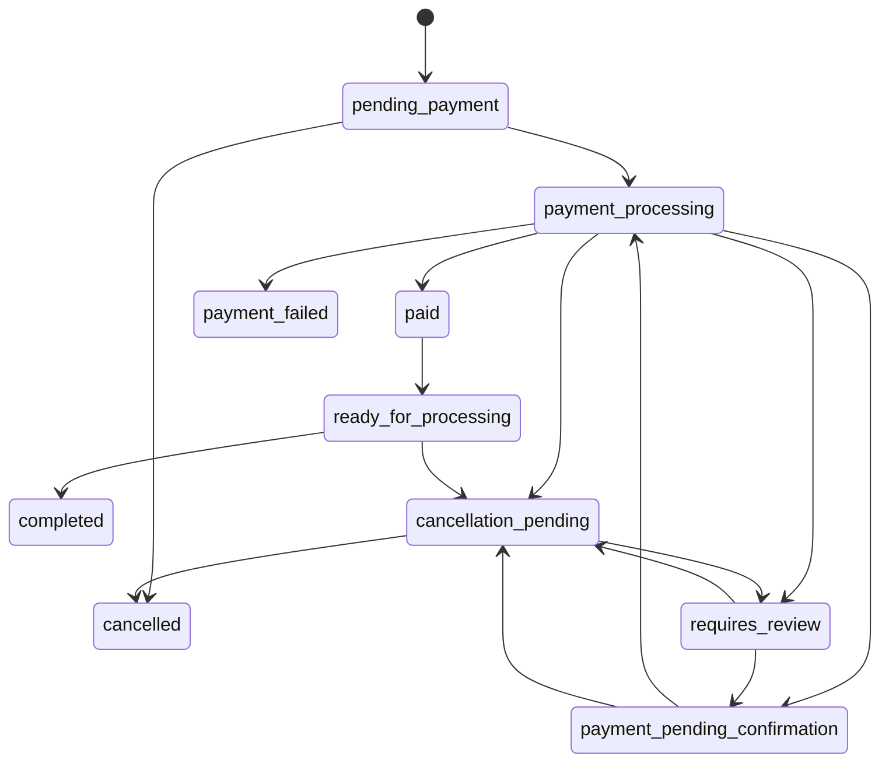

# Tasarım Kararları

Bu doküman; seçilen mimariyi, kullanılan pattern'leri, değerlendirilen alternatifleri ve neden bu yolların tercih edildiğini anlatır. Kurulum ve kullanım için: [README.md](README.md)

---

## 1. Genel Mimari

Proje **modüler tek uygulama** (modular monolith) olarak kuruldu. Laravel'in standart klasör yapısı korundu ve sorumluluklar şöyle ayrıldı:

| Katman | Sınıflar | Sorumluluk |
| --- | --- | --- |
| HTTP | `OrderController`, `PaymentController`, `MetricsController`, Form Request'ler, Resource'lar | Doğrulama, müşteri kapsamı, HTTP yanıtı |
| Middleware | `RequestContext`, `ResolveCustomer` | İstek kimliği ve loglama, müşterinin header'dan tanınması |
| İş kuralları | `OrderService`, `PaymentService`, `StockService`, `OutboxService` | Sipariş oluşturma/iptal/tamamlama, ödeme ilerletme, stok bırakma/tüketme, kalıcı mesaj kaydı |
| Model | `Order`, `Payment`, `Product`, `User`, `StockReservation` | Veri, ilişkiler, durum geçişi ve getter/setter'lar |
| Sağlayıcı | `PaymentGateway`, `MockPaymentGateway`, `ResilientPaymentGateway`, `CircuitBreaker` | Dış ödeme servisiyle konuşma ve kesinti koruması |
| Arka plan | `ProcessPayment`, `PublishOrderReady`, zamanlanmış komutlar | Asenkron ödeme, toparlanma, olay yayını |

Veri erişimi için Eloquent yeterli görüldü; her modele ayrıca repository katmanı eklenmedi.

**Temel kural:** Sipariş, stok ve ödeme niyeti **aynı MySQL transaction'ında** değişir. Ödeme sağlayıcısına yapılan çağrı ise **transaction dışında** yapılır. Böylece ağdan yanıt beklenirken sipariş veya ürün satırları kilitli tutulmaz.

### Müşteri kimliği

Case'te kimlik doğrulama istenmediği için login/token sistemi kurulmadı. Ancak müşteriler arası veri izolasyonu da önemli olduğundan müşteri `X-Customer-Id` header'ı ile tanımlanır:

- `ResolveCustomer` middleware'i header'daki müşteriyi bulur; bulamazsa `401` döner.
- Bulunan müşteri `$request->user()` üzerinden controller'lara verilir. Böylece ileride gerçek bir kimlik doğrulama eklendiğinde yalnızca bu middleware değişir; controller ve servisler aynı kalır.
- Sorgular her zaman müşteri ve mağaza ile sınırlandırılır. Başka müşterinin siparişi `403` yerine `404` döner; böylece siparişin var olup olmadığı dışarı sızmaz.
- Mağaza bilgisi istekten değil, müşteri kaydından alınır.

Bu yöntem bir güvenlik mekanizması değil, kapsam dışı bırakılan kimlik doğrulamanın yerine geçen bir **tanımlama** yöntemidir.

---

## 2. Kullanılan Pattern'ler

| Pattern | Koddaki karşılığı | Neden seçildi? |
| --- | --- | --- |
| **State Machine** | `OrderStatus::canTransitionTo`, `Order::transitionTo` | Tüm durum geçişleri tek yerde tanımlı; geçersiz geçiş `409` döner |
| **Adapter / Strategy** | `PaymentGateway` arayüzü, `MockPaymentGateway` | Akış belirli bir sağlayıcıya bağlı değil; gerçek sağlayıcı DI binding'i değiştirilerek eklenir |
| **Decorator** | `ResilientPaymentGateway` | Sağlayıcının koduna dokunmadan etrafına circuit breaker ekler |
| **Saga / Compensation** | Sipariş, ödeme ve stok servisleri | Dışarıda çekilen para bir DB rollback'i ile geri alınamaz; iptal ve iade açık telafi adımları olarak modellendi |
| **Transactional Outbox** | `OutboxService`, `outbox_messages` tablosu | DB commit'i ile kuyruğa gönderim arasındaki "mesaj kayboldu" penceresini kapatır |
| **Bulkhead + Circuit Breaker** | Mağaza bazlı kuyruklar ve `CircuitBreaker` | Bir mağazadaki sağlayıcı kesintisi diğer mağazaların worker kapasitesini tüketmez |
| **Idempotency Key** | `Idempotency-Key` header'ı, ödeme kaydındaki sağlayıcı anahtarı | Geri tuşu, tekrar gönderim ve retry'larda mükerrer sipariş/tahsilatı engeller |
| **Getter / Setter (Accessor & Mutator)** | `Product`, `User`, `Order`, `Payment` modelleri | Veri kaydedilmeden önce normalleştirilir, gösterim formatı tek yerde üretilir (ayrıntılar: [3. bölüm](#3-getter-ve-setter-kullanımı)) |

**Neden her durum için ayrı sınıf yok?** Durum sayısı ve duruma özel davranış şu an az olduğu için enum içindeki geçiş tablosu okunması en kolay çözüm. Duruma özgü davranışlar büyürse her durumu ayrı sınıfa (State pattern) taşımak mantıklı olur.

**Saga neden bir framework değil?** Süreç, kalıcı durum alanları ve telafi adımlarıyla servisler tarafından yürütülüyor. Bu büyüklükte ayrı bir orkestrasyon aracı gereksiz karmaşıklık getirirdi.

---

## 3. Getter ve Setter Kullanımı

### Neden klasik `getX()` / `setX()` değil?

Laravel'de model alanlarına `$product->price` şeklinde doğrudan erişilir. Her alan için `getPrice()` / `setPrice()` metodu yazmak Eloquent'in çalışma şekline ters düşer ve kural taşımayan alanlar için gereksiz kod üretir. Bu yüzden Laravel'in kendi getter/setter mekanizması olan **Accessor (getter) / Mutator (setter)** yapısı kullanıldı (`Illuminate\Database\Eloquent\Casts\Attribute`).

Getter/setter yalnızca **gerçekten bir kural taşıyan** alanlara eklendi:

- **Setter:** veri veritabanına yazılmadan önce otomatik olarak düzeltilir (normalleştirme).
- **Getter:** veritabanında olmayan, hesaplanan bir değer okunur (gösterim formatı).

### Nerelerde kullanıldı?

| Model | Tür | Alan | Ne yapar? |
| --- | --- | --- | --- |
| `Product` | Setter | `sku` | `"  store-1-book "` → `"STORE-1-BOOK"` (boşluk temizlenir, büyük harfe çevrilir) |
| `Product` | Setter | `name` | Baştaki ve sondaki boşlukları temizler |
| `Product` | Setter | `currency` | `"try"` → `"TRY"` |
| `User` | Setter | `email` | Küçük harfe çevirir; `Customer1@Example.test` ile `customer1@example.test` aynı kullanıcı sayılır |
| `Product` | Getter | `formatted_price` | `12500` → `"125,00 TRY"` |
| `Order` | Getter | `formatted_total` | `25000` → `"250,00 TRY"` |
| `Payment` | Getter | `formatted_amount` | `25000` → `"250,00 TRY"` |

### Koddaki örnekler

Setter, `app/Models/Product.php`:

```php
protected function sku(): Attribute
{
    return Attribute::make(set: fn (string $value) => strtoupper(trim($value)));
}
```

Getter, `app/Models/Order.php`:

```php
protected function formattedTotal(): Attribute
{
    return Attribute::make(get: fn () => Money::format($this->total_amount, $this->currency));
}
```

Kullanımı:

```php
$product = Product::create(['sku' => '  store-1-book ', /* ... */]);
$product->sku;              // "STORE-1-BOOK"  (setter kaydetmeden önce düzeltti)

$order->total_amount;       // 25000           (veritabanındaki değer)
$order->formatted_total;    // "250,00 TRY"    (getter hesapladı)
```

Getter'lar şu yerlerde kullanılıyor:

- `OrderResource` → API yanıtındaki `formatted_total`
- `PaymentResource` → API yanıtındaki `formatted_amount`
- `demo:products` komutu → fiyat sütunu

### Tasarım kuralları

- **Para hesabı getter'a bırakılmadı.** Tutarlar veritabanında ve tüm hesaplamalarda kuruş cinsinden tam sayı olarak kalır; getter'lar yalnızca gösterim içindir. Biçimlendirme tek bir yerde, `App\Support\Money` sınıfında yapılır ve float kullanılmaz. Böylece yuvarlama hatası oluşmaz.
- **Mevcut API bozulmadı.** `total_amount` ve `amount` alanları aynen duruyor; yanlarına `formatted_total` ve `formatted_amount` eklendi. Eski istemciler etkilenmez.
- **Sade veri sınıflarında getter/setter yok.** `GatewayResult`, `OrderReady` ve exception sınıflarında PHP 8'in `readonly` property'leri kullanıldı. Değer bir kez constructor'da verilir ve sonradan değiştirilemez; bu sınıflar için ayrıca getter/setter yazmak ek bir fayda sağlamaz.
- **Testlerle korunuyor.** `tests/Feature/ModelAttributeTest.php` setter'ların değeri düzelttiğini ve getter'ların doğru formatı ürettiğini kontrol eder. `OrderPaymentTest` de API yanıtındaki `formatted_total` alanını doğrular.

---

## 4. Sipariş Yaşam Döngüsü



| Durum | Anlamı |
| --- | --- |
| `pending_payment` | Sipariş oluştu, stok ayrıldı, ödeme bekleniyor |
| `payment_processing` | Worker sağlayıcıyla konuşuyor |
| `payment_pending_confirmation` | Sağlayıcıdan net yanıt alınamadı, sorgu/tekrar planlandı |
| `paid` → `ready_for_processing` | Ödeme kesinleşti, sipariş işlenmeye hazır |
| `payment_failed` | Ödeme kesin olarak reddedildi, stok bırakıldı |
| `cancellation_pending` | İptal istendi; iade veya sağlayıcı sorgusu bekleniyor |
| `cancelled` | İptal tamamlandı, stok geri eklendi |
| `requires_review` | Otomatik denemeler bitti, operatör incelemesi gerekiyor |
| `completed` | Sipariş teslim edildi, son durum |

Notlar:

- Diyagram ana yolları gösterir; tam geçiş tablosu `OrderStatus` enum'undadır.
- `paid` ve `ready_for_processing` aynı transaction'da yazılır; dışarıdan "yarım başarı" görünmez.
- Hazır sipariş hâlâ iptal edilebilir; bu durumda önce iade yapılır.
- `completed` son durumdur; sonrasında iade ayrı bir süreç gerektirir.

---

## 5. Tekrarlanan İstekler ve Eşzamanlılık

**Sipariş oluşturma**

- `Idempotency-Key`, müşteriyle birlikte veritabanında unique'tir.
- Sepet ürün kimliğine göre sıralanıp hash'lenir. Aynı anahtar + aynı sepet önceki siparişi döndürür; farklı sepet `409` alır.
- Aynı müşterinin eşzamanlı istekleri müşteri satırı kilitlenerek sıraya sokulur. Farklı müşteriler birbirini beklemez.

**Ödeme**

- `payments.order_id` unique constraint'i her siparişe tek ödeme kaydı garantisi verir; ödeme başlatılırken sipariş satırı kilitlenir.
- Sağlayıcıya gönderilen idempotency anahtarı bir kez üretilir; retry veya worker çökmesinde değişmez. İade de aynı sağlayıcı işlemi üzerinden tekrar güvenli şekilde yapılır.
- Dış dünyada "tek tahsilat" garantisi, sağlayıcının idempotency sözleşmesine dayanır. Uygulama içi kilitler tek başına exactly-once sağlamaz.

**Worker sahipliği (lease)**

- Ödemeyi işleyen worker 60 saniyelik bir sahiplik süresi ve rastgele bir token alır.
- Sağlayıcı yanıtı geldiğinde token hâlâ o worker'a aitse sonuç uygulanır. Süresi dolmuş eski bir worker, yeni worker'ın sonucunu ezemez.
- Süresi dolmuş bir tahsilat işi yeniden alındığında önce sağlayıcı **sorgulanır**; körlemesine ikinci tahsilat yapılmaz.

**Kilit sırası ve stok**

- Ürünler her zaman kimliğe göre sıralı kilitlenir. Oluşturmada müşteri → ürün, mevcut siparişte sipariş → ödeme → ürün sırası izlenir; bu sabit sıra deadlock ihtimalini azaltır.
- Stok atomik SQL güncellemeleriyle değişir. Rezervasyon durumu (`reserved` / `released` / `consumed`) stoğun iki kez iade edilmesini engeller.
- Kısa transaction'lar deadlock olursa en fazla üç kez tekrar denenir.

---

## 6. Zaman Aşımı, Kalıcı Hata ve İptal

- **Timeout, başarısız ödeme demek değildir.** Ödeme `pending_confirmation` olarak işaretlenir, bir `lookup` (sorgu) planlanır ve stok korunur. Mock sağlayıcı, paranın çekilip yanıtın kaybolduğu durumu da taklit eder.
- **Ödeme sürerken iptal:** Sipariş `cancellation_pending` olur. Sonuç başarılıysa bir sonraki iş iadeye dönüşür; kesin retse stok bırakılır; belirsizse sorgulanır. İade sonucu bilinmiyorsa da stok tutulur.
- **Kalıcı hata:** Beş denemeden sonra ödeme `requires_review` olur, hata kodu kaydedilir ve alarm logu yazılır. Sonucu bilinmeyen bir tahsilatı "başarısız" saymak, parası alınmış bir ürünün stoğunun başkasına satılmasına yol açabilir. Bu yüzden sistem kendini "belirsiz ama güvenli" bir durumda durdurur.
- `payments:reconcile` komutu operatör incelemesinden sonra sağlayıcıyı yeniden sorgular; sonucu elle varsaymaz. Kesin ret ile sağlayıcıya ulaşılamaması bu nedenle ayrı durumlar olarak ele alındı.
- Mock sağlayıcıda `not_found` kesin bir yanıttır. Gerçek sağlayıcı eventual consistency kullanıyorsa adapter bu yanıtı hemen kesin sonuç olarak yorumlamamalıdır.

---

## 7. Kuyruk ve Yeni Adımların Eklenmesi

**Transactional Outbox akışı**

1. Outbox satırı, iş verisiyle aynı transaction'da yazılır.
2. Scheduler her beş saniyede bekleyen satırı kilitler (`FOR UPDATE SKIP LOCKED`) ve RabbitMQ'ya gönderir.
3. Broker ACK verdikten (publisher confirms) sonra satır "gönderildi" olarak işaretlenir. Ret veya timeout olursa işaretleme geri alınır.
4. ACK ile commit arasında çökme olursa mesaj iki kez gidebilir; tüketiciler tekrar gelen mesajı güvenle yok sayar. Mesajlar kalıcı, kuyruklar durable'dır.

Ödeme outbox satırı, ödeme başına tekrar planlanabilen bir "iş niyeti"dir, sonsuz bir olay arşivi değildir. Sonraki denemede aynı satırın zamanı güncellenir. Recovery işi, süresi dolmuş sahiplikleri ve bir dakikadır işlenmemiş teslimleri yeniden hazırlar.

**Genişletilebilirlik**

Başarılı ödeme bir `order.ready` outbox kaydı üretir. `PublishOrderReady` işi `OrderReady` olayını yayınlar. Kargo, bildirim veya muhasebe gibi yeni adımlar bu olaya listener olarak abone olabilir; mevcut akışa dokunmak gerekmez. Yeni tüketiciler:

- yan etkilerini sipariş/olay kimliğiyle tekrar güvenli (idempotent) yapmalı,
- işlem anında siparişin son durumunu tekrar kontrol etmelidir.

---

## 8. Kesinti Yalıtımı

- Her mağazanın kendi kuyruğu (`store.{id}`), worker'ı ve scheduler'ı vardır. Bir mağazada biriken iş diğerini yavaşlatmaz.
- Circuit breaker anahtarı **mağaza + sağlayıcı** ikilisidir ve Redis'te tutulur; tüm worker'lar aynı durumu görür.
- Üç geçici hatadan sonra devre 30 saniye açılır ve istekler sağlayıcıya gitmeden hızlıca reddedilir. Süre dolunca tek bir deneme (probe) geçer; başarılıysa devre kapanır.
- Kesin ödeme reddi (kart reddi) servis kesintisi sayılmaz, devreyi açmaz.

Demo'da iki mağaza ayrı container'larla gösterildi. Çok sayıda mağazada kapasite kotaları veya dinamik worker dağıtımı gerekir. Ortak MySQL/Redis/RabbitMQ tamamen çökerse tüm mağazalar etkilenir; yüksek erişilebilirlik kurulmadı. Binlerce paralel sipariş için kesin bir kapasite iddiası yerine gerçek yük testi gerekir.

---

## 9. Log, Güvenlik ve Metrikler

**Loglama**

- Sabit olay adları ve JSON context kullanılır. İstek, ödeme, sipariş ve mağaza kimlikleri; durum, hata kodu ve süre ile birlikte teşhis için yeterli bilgi sağlar.
- `SafeContextProcessor` izin listesiyle çalışır: listede olmayan her alan (header, body, parola, kart, müşteri e-postası vb.) loga yazılmadan atılır. Ham exception mesajı ve SQL parametreleri yerine yalnızca exception sınıfı ve güvenli hata kodu tutulur.
- Durum geçişi logu commit sonrasında yazılır; geri alınan bir işlem logda başarılı gibi görünmez.

**Hassas veri**

- Kart numarası/CVV API'de kabul edilmez; ödeme verisi sağlayıcı tarafında kalır.
- Sağlayıcı idempotency anahtarı ve dahili alanlar API yanıtlarında gizlenir.
- Production ortamında düz HTTP istekleri `426` ile reddedilir; TLS'in reverse proxy'de sonlandırılması beklenir.

**Metrikler**

`/api/metrics` Prometheus formatında, `store_id` etiketiyle mağaza bazında gauge değerleri döner: duruma göre sipariş/ödeme sayıları, deneme toplamı, outbox birikimi ve en eski mesajın yaşı. Log sürelerinden histogram/sayaç üretmek gözlem altyapısına bırakıldı.

---

## 10. Değerlendirilen Alternatifler

| Alternatif | Neden seçilmedi? |
| --- | --- |
| Ödemeyi HTTP isteği içinde senkron yapmak | PHP worker'ı sağlayıcı yanıtını beklerken bloklanır; kesintide tüm API yavaşlar. Asenkron iş seçildi |
| Kuyruğa doğrudan `afterCommit` ile göndermek | Commit ile gönderim arasında süreç çökerse iş kaybolur. Kalıcı outbox seçildi |
| Mikroservisler | Bu büyüklükte dağıtım ve dağıtık tutarlılık maliyeti faydadan fazla. Modüler tek uygulama yeterli |
| Her adım için repository / generic pipeline / handler sınıfları | Takip edilecek sınıf sayısını artırır. Arayüz sadece gerçekten değişebilecek noktada (ödeme sağlayıcısı) kullanıldı |
| Timeout'ta siparişi hemen iptal etmek | Para çekilmiş olabilir; stok ile tahsilat arasında tutarsızlık oluşur. Önce sorgu, gerekirse iade seçildi |
| Sanctum ile token tabanlı kimlik doğrulama | İlk versiyonda vardı. Case'te istenmediği için kaldırıldı; müşteri izolasyonu `X-Customer-Id` header'ı ile korundu |

---

## 11. Kaynaklar

Framework API'leri ve pattern davranışları için aşağıdaki belgelerden yararlanıldı. İlgili sınıfların içinde de kısa kaynak yorumları bulunur. Laravel iskeleti ve paket lisansları kendi dosyalarında korunur.

- [Laravel log yapılandırması](https://github.com/laravel/docs/blob/13.x/logging.md)
- [Laravel kuyruk API'si](https://api.laravel.com/docs/13.x/Illuminate/Queue/DatabaseQueue.html)
- [Circuit Breaker, Martin Fowler](https://martinfowler.com/bliki/CircuitBreaker.html)
- [Transactional Outbox, microservices.io](https://microservices.io/patterns/data/transactional-outbox.html)
- [RabbitMQ publisher confirms](https://www.rabbitmq.com/docs/confirms)
- [Claude Code](https://claude.com/claude-code): Anthropic'in yapay zeka destekli geliştirme aracı

### Yapay zeka araçlarının kullanımı

Bu projenin tasarımında ve geliştirilmesinde **Claude Code** kullanılmıştır. Destek alınan başlıca konular:

- Sanctum kimlik doğrulamasının kaldırılması ve yerine `X-Customer-Id` ile müşteri tanımlamanın eklenmesi
- Hataların tespiti ve düzeltilmesi (örneğin tekrar gönderilen isteklerin `200` yerine `302` dönmesi)
- Demo verisi (`DemoDataSeeder`), getter/setter yapısı ve bunlara ait testler
- Postman collection'ı ile README.md ve DESIGN.md dokümantasyonu

Mimari kararlar, varsayımlar ve kapsam seçimleri proje sahibi tarafından verilmiştir. Üretilen kod incelenmiş, testlerle (`php artisan test`, MySQL entegrasyon testleri) ve Docker ortamında gerçek isteklerle doğrulanmıştır.

Laravel Boost yalnızca geliştirme bağımlılığıdır; ödeme akışının parçası değildir.
